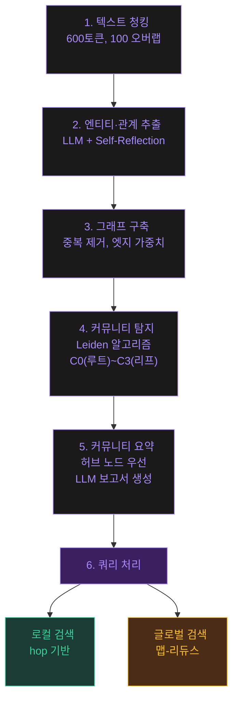

# Tier 1: 핵심 (Core Concepts)

> GraphRAG·온톨로지·메타엣지·팔란티어 AIP·위상학적 지능
> — 확률적 지능에서 구조적 지능으로의 전환점

---

## C01 — GraphRAG

**TL;DR**: 전체 문서 코퍼스를 지식 그래프로 변환하고 커뮤니티 단위 계층 요약을 사전 생성. 확률적 지능에서 구조적·위상학적 지능으로의 전환점.

### RAG의 3가지 구조적 한계
1. **멀티홉 추론 불가**: 인과 관계가 여러 청크에 분산
2. **관계 표현 부재**: 벡터 유사도만으로 명시적 관계 포착 불가
3. **글로벌 패턴 파악 불가**: 전체 코퍼스의 주제 분포·커뮤니티 구조 미포착

### 인덱싱 파이프라인 6단계



1. **텍스트 청킹** — 600토큰, 100토큰 오버랩
2. **엔티티·관계 추출** — LLM이 엔티티/관계/클레임 식별 + Self-Reflection
3. **그래프 구축** — 중복 제거, 엣지 가중치(등장 빈도) 부여
4. **계층적 커뮤니티 탐지** — Leiden 알고리즘, C0(루트)~C3(리프) 4계층
5. **커뮤니티 요약 생성** — 허브 노드 우선, LLM이 보고서 형식 요약 사전 생성
6. **쿼리 처리: 맵-리듀스** — 로컬(hop 기반) + 글로벌(커뮤니티 요약 병렬)

### DRIFT (2024.10)
Dynamic Reasoning and Inference with Flexible Traversal — 글로벌 커뮤니티 요약을 동적으로 탐색

  기존 글로벌 검색이 모든 커뮤니티 요약을 한 번에 처리했다면, DRIFT는 질문과 관련 있는 커뮤니티만 선택적으로 깊이 탐색한다. 넓고 얕은 검색에서 좁고 깊은 검색으로의 진화다.

---

## C02 — 온톨로지 (Ontology)

**TL;DR**: "어떤 세계에 무엇이 존재하는가"를 형식적으로 명시한 지식 구조

### 정의 (Gruber, 1993)
> "온톨로지는 개념화(conceptualization)의 명시적(explicit)이고 형식적인(formal) 명세(specification)"

### 구성 요소: 클래스·속성·관계·공리/규칙

  예를 들어 병원 온톨로지라면: 클래스(환자, 의사, 질병), 속성(환자.나이, 질병.증상), 관계(의사 -진료→ 환자), 공리("응급환자는 반드시 30분 내 진료")로 구성된다.

### 온톨로지의 진화 5단계
1. 아리스토텔레스 범주론
2. 1980~90년대 AI 지식 표현
3. 시맨틱 웹 (OWL/RDF, W3C)
4. 지식 그래프 (Google, Wikidata)
5. **LLM + 온톨로지 결합** (GraphRAG, 에이전트 온톨로지) ← 현재

### 팔란티어 온톨로지: 운영 지향 아키텍처
- **Object Type**: 엔티티 정의
- **Link Type**: 관계 정의
- **Action Type**: **"무엇을 할 수 있는가"** ← 핵심 혁신 (Kinetic Elements)
- **Property Type**: 속성 정의

> 전통 온톨로지(정적) vs 팔란티어 온톨로지(동적, 실시간, AI 네이티브 통합)

### 온톨로지 vs 스키마 vs 택소노미
| 특성 | 택소노미 | 스키마 | 온톨로지 |
|------|---------|--------|---------|
| 관계 | IS-A만 | 정의된 관계 | 다양한 관계 + 제약 + 규칙 |
| 추론 | 불가 | 제한적 | 가능 (OWL 추론기) |

### 메타온톨로지
> "도메인의 전문적인 Domain specific ontology를 쌓아가다보면, 자연스레 '온톨로지를 추출하기 위한 온톨로지 = 메타온톨로지'를 습득"

  여러 도메인의 온톨로지를 만들다 보면 "모든 도메인에 공통되는 패턴"이 보이기 시작한다. 이 공통 패턴을 체계화한 것이 메타온톨로지다. 요리법(도메인 온톨로지)을 많이 만들다 보면 "좋은 요리법을 만드는 원칙"(메타온톨로지)을 깨닫게 되는 것과 같다.

---

## C03 — 메타엣지 (Meta-Edge)

**TL;DR**: 일반 엣지(두 노드 간 관계)보다 한 층 위에 존재하는 **"관계에 대한 관계"** 또는 **"판단 기준 자체를 정의하는 연결"**

### 한 문장 요약
메타엣지는 "관계를 정의하는 규칙" — 데이터 간 연결이 아니라, 그 연결을 만드는 기준 자체를 뜻한다.

### 왜 이것이 필요한가
전화번호부를 생각해보자. "홍길동 → 010-1234-5678"은 일반 엣지(관계)다. 그런데 "모든 전화번호는 반드시 11자리여야 한다"는 규칙은? 이것이 메타엣지다 — 엣지를 정의하는 규칙이다.

실무에서 이미 메타엣지를 사용하고 있다. DB의 외래키 제약("주문은 반드시 고객에 연결되어야 한다"), API의 인증 규칙("이 엔드포인트는 admin만 호출 가능"), 코드의 인터페이스("이 클래스는 반드시 save() 메서드를 구현해야 한다") — 이것들이 모두 메타엣지다. 이름만 몰랐을 뿐이다.

메타엣지를 의식적으로 관리하면 시스템의 "보이지 않는 규칙"이 드러나고, 온톨로지 설계의 품질이 근본적으로 달라진다.

### 메타엣지의 4가지 의미
1. **엣지에 대한 엣지**: 엣지 자체가 노드가 되는 구조
2. **엣지를 정의하는 규칙**: 어떤 조건에서 어떤 엣지를 생성할 것인가
3. **엣지들 사이의 관계**: 두 종류의 관계 타입이 맺는 관계
4. **엣지 타입을 결정하는 상위 판단**: Named Graph(Quad) 구현

### 창발 (Emergence)
> "엣지 간 관계가 맺어질 때 어느 단일 엣지도 단독으로 표현하지 못했던 새로운 개념이 생성된다"

### 실무적 핵심
DB의 외래키 제약, API의 인증 규칙, 코드의 인터페이스 — 이것들이 모두 이미 실무에서 쓰이는 메타엣지다. 이름만 몰랐을 뿐이다.

### 레버리지 효과
> "한번더 메타계층이나온다 이게 레버다" — 메타엣지 하나를 바꾸면 하위의 모든 일반 엣지들이 영향을 받는다

---

## C04 — 팔란티어 AIP + Apollo

**TL;DR**: 20년간 축적한 메타온톨로지 위에 AI 실행 레이어(AIP) + 자율 배포(Apollo)를 올린 구현체

### 4개 레이어 아키텍처
1. **Foundry** — 데이터 통합 플랫폼
2. **Ontology** — 조직의 디지털 트윈 (아키텍처의 심장부)
3. **AIP** — AI 실행 레이어 (LLM Gateway, Agent Studio, Evals)
4. **Apollo** — 자율 배포 플랫폼 (Hub-Spoke, 에어갭까지 배포)

  이 4층 구조는 데이터(Foundry)를 토대로, 그 위에 조직의 구조(Ontology)를 세우고, AI를 실행(AIP)한 후, 현장에 배포(Apollo)하는 순서다. 각 층이 아래 층에 의존하며, 온톨로지가 중심축 역할을 한다.

### OAG (Ontology Augmented Generation)
```
[RAG]      쿼리 → 벡터 검색 → 텍스트 청크 → LLM → 텍스트 응답
[GraphRAG] 쿼리 → 그래프 탐색 → 관계 포함 컨텍스트 → LLM → 텍스트 응답
[OAG]      쿼리 → 온톨로지 탐색 → 구조화된 객체+관계+액션 → LLM → 실행 가능한 의사결정
```

  RAG가 "관련 텍스트를 찾아서 답변"이라면, GraphRAG는 "관계까지 포함해서 답변", OAG는 "구조화된 객체와 실행 가능한 액션까지 포함해서 의사결정을 내리는" 단계로 진화한다. 단순 텍스트 응답에서 실제 행동으로의 전환이 핵심이다.

### 메타온톨로지 축적 메커니즘
1. 정부 계약을 R&D 실험실로 활용
2. FDE 모델: 고객 조직에 임베드 → 도메인 지식 → 온톨로지 변환
3. 폐쇄 루프 강화: 데이터 → 온톨로지 → AI → 의사결정 → 환류
4. 네트워크 효과: 고객 수 ↑ → 메타온톨로지 밀도·품질 ↑↑

### AIP 12대 핵심 역량
- LLM 통합, 컨텍스트 엔지니어링, OAG
- 에이전트 라이프사이클, 운영 자동화, AIP Evals
- 역할/마킹/목적 기반 제어, AI FDE

---

## C05 — 위상학적 지능 (Topological Intelligence)

**TL;DR**: 확률적 유사도 탐색 → 구조적 관계 분석으로의 패러다임 전환

### 한 문장 요약
AI의 지능을 "확률적 추측"에서 "구조적 이해"로 전환하는 패러다임이다.

### 왜 이것이 필요한가
기존 LLM은 "이 단어 다음에 어떤 단어가 올 확률이 높은가?"로 작동한다. 이것은 확률적 지능이다. 하지만 "이 개념은 저 개념과 어떤 구조적 관계에 있는가?"는 확률로 답할 수 없다.

지도를 예로 들어보자. 벡터 유사도는 "서울과 부산이 얼마나 비슷한 도시인가?"를 측정한다. 위상학적 지능은 "서울에서 부산까지 어떤 경로로 연결되고, 중간에 어떤 거점이 있으며, 이 네트워크 구조가 무엇을 의미하는가?"를 분석한다.

GraphRAG가 이 전환의 시작점이다. 관계를 벡터 공간에서 유추하는 대신 그래프 엣지로 명시적으로 저장하고, 그래프 거리·홉 수·커뮤니티 구조로 측정한다. 6개 분석공간(C06)은 이 위상학적 분석의 구체적 도구다.

### 핵심 가치
- **재사용 가능성** (Reusability): 온톨로지로 저장, 도메인 전이 가능

  한 번 만든 분석 구조를 다른 프로젝트에서도 재활용할 수 있다. "고객 이탈 분석" 온톨로지를 만들면, 다른 산업의 이탈 분석에도 적용할 수 있다.

- **측정 가능성** (Measurability): 베티 수(Betti numbers), 분석공간으로 정량화

  "이 지식 그래프가 얼마나 잘 구조화되어 있는가?"를 수치로 측정할 수 있다. 베티 수는 그래프의 연결 요소 수, 고리 수 등 구조적 특징을 숫자로 표현한다.

### 6개 분석공간 = 위상학적 지능의 실용화

| # | 분석공간 | 핵심 질문 | GraphRAG 구현 |
|---|---------|-----------|--------------|
| 1 | **Hierarchy (계층)** | 이것은 어느 수준에 있는가? | Leiden 커뮤니티 계층 |
| 2 | **Temporal (시간)** | 언제, 어떤 리듬으로 발생? | 이벤트 시퀀스 위상 |
| 3 | **Recursive (재귀)** | 자기 자신을 어떻게 참조? | 서브에이전트 재귀 분해 |
| 4 | **Structural (구조)** | 개념 간 관계 구조? | 온톨로지 그래프 분석 |
| 5 | **Causal (인과)** | 무엇 때문에 발생? | Impact Analysis |
| 6 | **Cross-space (다중공간)** | 다른 공간들과 어떻게 연결? | 에이전트 메타 조율 |

### 위상학적 지능이 해결하는 5가지 문제
1. 의도-표현 갭 → 온톨로지 기반 의미 풍부화
2. 케이스 규모 확장 → O(n²) → O(log n)
3. 지능 비재사용성 → 온톨로지 캐싱, "Search before code"
4. 측정 불가능성 → 베티 수, 분석공간 차원
5. 고지능 태스크 비용 → 재귀 분해 + 경량 모델 분배

### 구현 로드맵
| 규모 | 구현 수준 |
|------|----------|
| 개인/스타트업 | "Search before code" + 도메인 온톨로지 초안 |
| 중소기업 | GraphRAG + 도메인 온톨로지 + Impact Analysis |
| 대기업 | GraphRAG + ReBAC + 메타온톨로지 + 위상학적 지능 (AIP 수준) |

---

## 이해도 점검

<script setup>
import Quiz from '../.vitepress/theme/components/Quiz.vue'
import quizData from '../.vitepress/theme/data/quizzes.json'
</script>

<Quiz :title="quizData.core.title" :questions="quizData.core.questions" />
