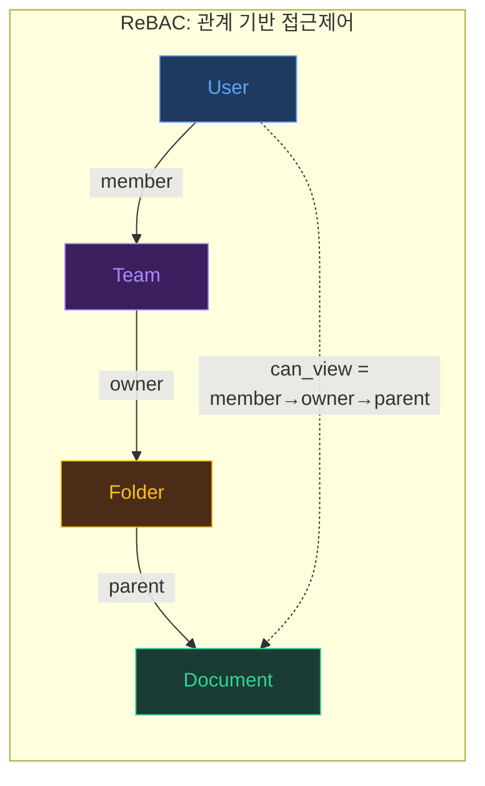

# Tier 2: 프레임워크 (Framework)

> 분석공간 6가지·ReBAC·메타온톨로지·도메인 온톨로지·벡터 의미 풍부화
> — 핵심 개념들을 실무에 적용하는 설계 원칙

---

## C06 — 분석공간 6가지 (Analysis Spaces)

**TL;DR**: 지능 시스템이 문제를 바라보고 처리하는 6가지 독립적이면서 상호연결된 위상적 차원

### 상세 정의

**1. 계층공간 (Hierarchy Space)**
- 상위-하위 구조 분석. 상위 계층의 결론을 하위에 적용하거나 반대로 올리는 것은 왜곡의 핵심 실수
- 구현: Leiden 커뮤니티 C0~C3, 팔란티어 Object Type 계층

**2. 시간공간 (Temporal Space)**
- 리듬(rhythm), 주기(cycle), 위상(phase), 속도(velocity) 분석
- 엔티티는 시간 축 위에서 생성·변화·소멸: 잠재고객→가입→활성→이탈→복귀

**3. 재귀공간 (Recursive Space)**
- 메타인지, 자기 개선, 피드백 루프. 재귀 없이는 학습·지능 성장이 불가
- 프랙탈 분해: 10개를 50개로 쪼개는 과정이 핵심 패턴
- 메타 후퇴(Meta-Regress): 도메인 온톨로지가 앵커

**4. 구조공간 (Structural Space)**
- Leiden 알고리즘의 커뮤니티 탐지가 대표적 사례
- NOMIK의 모듈 간 의존성 구조 발견

**5. 인과공간 (Causal Space)**
- 원인-결과 사슬 추적. 상관관계 ≠ 인과관계
- NOMIK의 Impact Analysis: "변경하면 무엇이 영향받는가?"

**6. 다중공간 (Cross-space)**
- 나머지 5개 공간을 동시 고려할 때 나타나는 **창발적 차원**
- 팔란티어 AIP = 다중공간의 구현체

### 실전 적용 예시: "고객 이탈"을 6개 공간으로 분석

| 공간 | 분석 질문 | 구체적 적용 |
|------|----------|-----------|
| 계층 | 이탈은 어느 고객 등급에서 발생하는가? | VIP vs 일반 고객 이탈률 비교 |
| 시간 | 이탈의 시간적 패턴은? | 가입 후 3개월 시점 이탈률 급증 발견 |
| 재귀 | 이탈 방지 시스템이 자기 개선하는가? | 이탈 예측 모델의 정확도 추적 → 피드백 루프 |
| 구조 | 이탈 고객의 관계 구조는? | 커뮤니티 내 허브 고객 이탈 시 연쇄 이탈 |
| 인과 | 이탈의 근본 원인은? | 가격 인상 vs 서비스 불만 vs 경쟁사 유입 |
| 다중 | 위 분석들을 통합하면? | "3개월차 일반 고객 중 커뮤니티 허브가 가격 민감도 높음" |

---

## C07 — ReBAC (Relationship-Based Access Control)

**TL;DR**: 관계 그래프로 권한 표현. 접근 허용 ⟺ Subject →[관계 경로]→ Object 사이에 유효한 경로 존재



### RBAC의 3가지 구조적 한계
1. 역할 폭발 (Role Explosion)
2. 동적 조건 표현 불가
3. 관계 맥락 표현 불가

### Google Zanzibar
- 모든 접근제어를 **관계 튜플**로 통합
- 예: $\text{can\_view} = \text{viewer} \cup \text{editor} \cup \text{owner} \cup \text{parent.can\_view}$
- 초당 수백만 건 판정, p95 < 10ms

### 핵심 통찰
> **온톨로지 = 검색 구조 = 접근제어 구조**
> 하나의 온톨로지가 세 가지 역할을 동시에 수행

### 실전 비교: RBAC vs ReBAC

**상황**: 김팀장은 A프로젝트의 팀장이고, 이 프로젝트 내 문서에 접근해야 한다.

**RBAC 방식**: "A프로젝트-팀장" 역할 생성 → 권한 부여. 하지만 B프로젝트의 팀장도 되면? "B프로젝트-팀장" 역할 추가. 10개 프로젝트 × 5개 직급 = 50개 역할 폭발.

**ReBAC 방식**: "김팀장 →[member]→ A팀 →[owner]→ A프로젝트 →[parent]→ 문서". 관계 경로만 따라가면 권한이 자동 결정된다. 새 프로젝트가 추가되어도 관계만 연결하면 끝. 역할 폭발 없음.

---

## C08 — 메타온톨로지 (Meta-Ontology)

**TL;DR**: "온톨로지를 만들기 위한 온톨로지" — 도메인을 초월한 공통 패턴

### 3층 추상화 계층
```
Level 3: Universal Principals (보편 원칙)
  ↑ "도메인에 상관없이 활용 가능한 범용 지능"
Level 2: Meta-Ontology (메타온톨로지)
  ↑ "온톨로지를 추출하기 위한 온톨로지"
Level 1: Domain-Specific Ontology (도메인 특화 온톨로지)
```

### Universal Principal 예시
```
도메인 1 (기업 HR):     직원 → 관리자 → 임원
도메인 2 (면역시스템):   T세포 → B세포 → 항체생성
도메인 3 (공급망):       본사 → 물류센터 → 매장

→ 공통 메타엣지: "시스템의 성공적 운영은 중앙부(Core)와 말단부(Edge)의 성공적 소통에 달려있다"
```

  병원, 군대, 회사 모두에서 "중앙-말단 소통"이라는 공통 패턴이 발견된다. 이처럼 도메인을 넘어 반복되는 구조적 원칙을 추출하면, 새로운 도메인을 분석할 때 "이미 알고 있는 패턴"을 적용하여 빠르게 온톨로지를 구축할 수 있다.

### 팔란티어 축적 메커니즘
FDE가 고객 조직에 임베드 → 도메인 지식을 온톨로지로 변환 → 공통 패턴 추출 → 복리적 증가

---

## C09 — 도메인 온톨로지 (Domain-Specific Ontology)

**TL;DR**: 특정 분야의 개념·관계·규칙을 형식화. AI 의미 해석 가이드레일 + 시멘틱 드리프트 앵커

### 4가지 구성 요소
1. **클래스(Classes)**: 핵심 개념 범주

   "환자", "의사", "처방전"처럼 도메인의 주요 개념을 분류한 것이다.

2. **속성(Properties)**: 개체 특성

   "환자.나이", "처방전.날짜"처럼 각 개념이 가진 세부 정보를 정의한다.

3. **관계(Relations)**: 개체 간 연결

   "의사 →[처방]→ 처방전", "처방전 →[대상]→ 환자"처럼 개념들이 어떻게 연결되는지를 정의한다.

4. **공리/규칙(Axioms)**: 제약 조건

   "처방전은 반드시 의사 1명과 연결되어야 한다", "환자 나이가 18세 미만이면 보호자 동의 필요"처럼 반드시 지켜야 할 규칙이다.

### 5단계 구축 프로세스
1. **범위 설정**: 구체적 업무 흐름으로 한정 (넓으면 실패)
2. **재료 수집**: 도메인 전문가 인터뷰, 예외 상황이 중요한 재료
3. **구조화**: 4개 구성 요소로 분류 — 처음부터 완벽할 필요 없음(70%)
4. **검증·정제**: 프롬프트 적용 → 오류 역추적 → 온톨로지 정제
5. **유지보수**: 버전 관리 + 변경 이유 기록

### 검증 체크리스트
- **완전성**: 고객 문의 100건 샘플링 → 80% 이상 처리 가능하면 1차 완성
- **일관성**: 모순된 관계/공리가 없는가
- **사용성**: 도메인 전문가가 즉시 이해하는가

### 미니 예시: "온라인 쇼핑" 도메인 온톨로지

```
[클래스]   고객, 주문, 상품, 카테고리, 리뷰
[속성]     고객.등급(일반/VIP), 주문.금액, 상품.재고
[관계]     고객 -PLACED→ 주문
           주문 -CONTAINS→ 상품
           상품 -BELONGS_TO→ 카테고리
           고객 -WROTE→ 리뷰 -ABOUT→ 상품
[규칙]     IF 고객.등급="VIP" AND 주문.금액>50만원 THEN 배송="무료"
           IF 상품.재고=0 THEN 주문.상태="대기"
```

이 간단한 5-엔티티 온톨로지만으로도: 상품 추천(관계 탐색), 재고 관리(규칙 적용), 접근제어(고객 등급별 가격 노출)가 가능하다.

---

## C10 — 벡터 의미 풍부화 (Vector Semantic Enrichment)

**TL;DR**: 프롬프트(사용자 입력)는 구조적으로 불완전. 의미를 확장하여 검색 품질 향상.

### 의도-표현 갭
```
사용자 입력: "권한 설정 방법 알려줘"
실제 의도:   "ReBAC 기반 역할-관계 권한 설정, Supabase RLS 정책 포함"
```

### 3단계 풍부화 파이프라인
1. **유사단어 목록 생성** (Lexical Expansion): 동의어·유의어·관련어·번역어

   "권한"이라는 단어에서 시작하여 "허가", "인가", "permission", "authorization" 등 같은 의미의 다양한 표현을 자동으로 확장한다.

2. **의미 다층화** (Semantic Layering): 추상→구체, 일반→특수 계층화

   "보안"(추상) → "접근제어"(중간) → "Supabase RLS 정책"(구체)처럼, 하나의 개념을 추상도에 따라 여러 층으로 펼쳐 검색 범위를 넓힌다.

3. **도메인 온톨로지 정렬 + 왜곡 방지**: C09가 앵커 역할

   확장이 너무 넓어지면 원래 의도에서 벗어날 수 있다. 도메인 온톨로지가 "이 맥락에서 권한은 ReBAC를 의미한다"라고 방향을 잡아주어 검색 결과의 정확도를 유지한다.

### 실전 예시: 3단계 풍부화

**원본 쿼리**: "권한 설정 방법"

**1단계 — 유사단어 확장**: 권한, 허가, 인가, 접근제어, permission, authorization, ACL

**2단계 — 의미 다층화**:
- 추상: 보안 정책, 거버넌스
- 구체: Supabase RLS, OpenFGA 튜플, Row Level Security
- 관련: 역할, 팀, 소유자, 관계 경로

**3단계 — 온톨로지 정렬**: 도메인 온톨로지(C09)에서 "권한"은 ReBAC(C07)의 관계 경로와 매핑 → 최종 쿼리: "ReBAC 기반 역할-관계 권한 설정, Supabase RLS 정책 포함"

---

## 이해도 점검

<script setup>
import Quiz from '../.vitepress/theme/components/Quiz.vue'
import quizData from '../.vitepress/theme/data/quizzes.json'
</script>

<Quiz :title="quizData.framework.title" :questions="quizData.framework.questions" />
