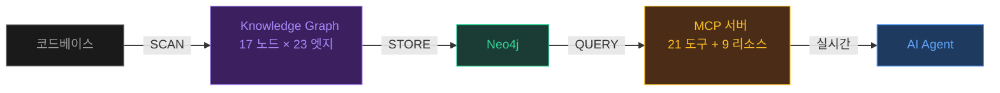
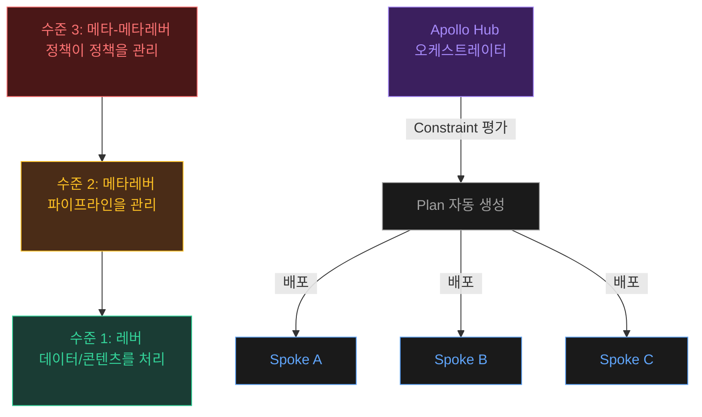

# Tier 3: 구현 (Implementation)

> NOMIK·FDE·레버/메타레버·물리적 계산 엔진·Active Metadata
> — 이론을 현실로 만드는 구현 레이어

---

## C11 — NOMIK Framework

**TL;DR**: 코드베이스 → Neo4j 지식 그래프 → MCP로 AI에 노출. "Scan once, query everything."

### 핵심 문제 인식: 구조적 환각
기존 RAG dump: 47개 파일 노이즈를 AI에게 쏟아붓는다
NOMIK: **6개의 정확한 관계 노드만 전달**

### 아키텍처: 17 노드 타입 × 23 엣지 타입
- **구조 관계**: CONTAINS, IMPORTS, EXPORTS, EXTENDS, IMPLEMENTS
- **실행 관계**: CALLS, WRITES_TO, SCHEDULES
- **MCP 도구**: 21개
- **MCP 리소스 엔드포인트**: 9개

  코드의 구조(어떤 파일이 어떤 파일을 포함하고 상속하는지)와 실행 흐름(어떤 함수가 어떤 함수를 호출하는지)을 모두 그래프로 저장한다. MCP를 통해 AI 에이전트가 이 그래프에 실시간으로 질의할 수 있다.

### 3단계 작동

1. **SCAN** — 코드베이스 전체 파싱 → Knowledge Graph 구축
2. **STORE** — 모든 관계를 Neo4j에 영속 저장
3. **QUERY** — AI가 MCP를 통해 실시간 그래프 쿼리

### 본질
> grep이 "이 문자열이 어디 있는가"를 답한다면, NOMIK은 **"이 심볼을 변경하면 무엇이 깨지는가"**를 답한다

### 시작하기: 첫 번째 단계
20개 이하 파일로 구성된 작은 프로젝트를 하나 골라보자. Python의 `ast` 모듈로 import 관계를 추출하고, NetworkX로 의존성 그래프를 시각화해보자. "이 파일을 수정하면 어떤 파일이 영향받는가?"라는 질문에 그래프가 즉시 답을 줄 것이다. 이것이 NOMIK의 핵심 아이디어를 체험하는 가장 빠른 방법이다.

---

## C12 — FDE (Forward Deployed Engineer)

**TL;DR**: 소프트웨어 엔지니어를 고객 현장에 직접 파견하는 팔란티어 발명 역할

### 일반 제품 엔지니어 vs FDE
| 구분 | 일반 제품 엔지니어 | FDE |
|------|-------------------|-----|
| 방향 | 다수 고객을 위해 소수 기능 | 단일 고객을 위해 다수 기능 |
| 배포 환경 | 자사 인프라 | 고객사 운영 환경 |
| 시간 지평 | 로드맵 기반 | 고객 긴급도 기반 |

### 브릿지 역할 4가지
1. **언어 번역**: 도메인 언어 → 플랫폼 언어 (Object Type, Action Type)

   고객사에서 "거래처"라고 부르는 것을 시스템에서는 "Vendor" Object Type으로 정의하는 것처럼, 현장 용어를 시스템이 이해하는 구조로 변환한다.

2. **우선순위 매핑**: 비즈니스 가치 → 기술 구현 우선순위

   "매출에 가장 큰 영향을 주는 기능"을 먼저 구현하도록 기술팀의 작업 순서를 비즈니스 관점에서 조정한다.

3. **변화 관리**: 조직 내 저항 극복

   새 시스템 도입 시 "기존 방식이 더 편하다"는 저항을 극복하기 위해, 현장 직원과 함께 일하면서 시스템의 가치를 체감하게 만든다.

4. **피드백 환류**: 도메인 지식 → 메타온톨로지로 축적

   현장에서 발견한 도메인 패턴("모든 제조업에서 품질검사→출하 프로세스가 있다")을 메타온톨로지에 추가하여, 다음 고객사에서는 더 빠르게 적용한다.

### 진짜 가치: 메타온톨로지 축적 엔진
100개 고객사 도메인 온톨로지 → 공통 패턴 추출 → 101번째 고객사에 즉시 적용

### 시작하기: 첫 번째 단계
조직 내 도메인 전문가 한 명을 찾아 30분간 인터뷰해보자. "평소 어떤 판단 기준으로 의사결정을 하시나요?"라고 물어보고, 그 답변을 IF-THEN 규칙 목록으로 정리해보자. 이것이 도메인 온톨로지의 씨앗이다. FDE가 고객사에서 가장 먼저 하는 일이 바로 이것이다.

---

## C13 — 레버 / 메타레버 (Lever / Meta-Lever)

**TL;DR**: 레버 = 파이프라인. 메타레버 = 파이프라인을 관리하는 파이프라인. 실무 구현: Palantir Apollo

### 레버의 5가지 핵심 속성
1. **합성성** (Composability): 여러 레버를 연결해 더 큰 레버

   레고 블록처럼 작은 파이프라인을 조합하여 더 큰 파이프라인을 만들 수 있다.

2. **관찰 가능성** (Observability): 각 단계 상태 추적

   파이프라인의 각 단계가 현재 어떤 상태인지, 어디서 병목이 생기는지를 실시간으로 모니터링할 수 있어야 한다.

3. **멱등성** (Idempotency): 같은 입력 → 같은 결과

   같은 데이터를 두 번 처리해도 결과가 변하지 않아야 한다. 실수로 같은 요청을 두 번 보내도 문제가 생기지 않는다는 뜻이다.

4. **실패 복원력** (Resilience): 재시도, 폴백

   중간에 오류가 나면 자동으로 재시도하거나, 대안 경로로 전환하여 전체 시스템이 멈추지 않도록 한다.

5. **버전 관리** (Versioning): 파이프라인 자체의 변경 이력

   파이프라인의 설정이나 로직이 바뀔 때마다 이력을 남겨, 문제가 생기면 이전 버전으로 되돌릴 수 있다.

### 추상화 수준 계층

### Apollo: 실무 구현체
- **Hub**(오케스트레이터) + **Spoke**(실행 환경)
- Constraint 기반 평가 → Plan 자동 생성 → Agent 실행 → 결과 보고

### 실전 예시
| 도메인 | 레버 | 메타레버 |
|--------|------|---------|
| CI/CD | 배포 파이프라인 | GitOps 오케스트레이터 (ArgoCD) |
| RAG | RAG 파이프라인 | 평가·최적화 시스템 (LangSmith) |
| 에이전트 | 에이전트 워크플로 | 에이전트 오케스트레이터 (CrewAI) |

### 시작하기: 첫 번째 단계
현재 사용 중인 CI/CD 파이프라인을 하나 골라보자. 이것이 "레버"다. 그런 다음 질문하자: "이 파이프라인이 실패하면 누가 감지하는가? 자동으로 재시도하는가? 실패 패턴을 학습하는가?" 이 감시·관리 시스템이 "메타레버"다. 아직 없다면, 가장 단순한 메타레버(Slack 알림 + 수동 재시작)부터 시작해보자.

---

## C14 — 물리적 계산 엔진 (Physical Computation Engine)

**TL;DR**: 순차 처리 → 프랙탈 재귀 분해 + 병렬 에이전트 실행. 에이전트 = 계산 노드.

### 기존 한계: 순차성
- LLM 하나가 A→B→C 순차 처리: 10개면 10배 느림
- 물리적 계산 엔진: N개 에이전트 → Critical Path 길이만큼만 소요
- **선형 → 로그 시간 복잡도로 도약**

### 프랙탈 자기유사성
- 에이전트가 작동하는 방식 = 에이전트 팀이 작동하는 방식
- 확장 시 새 규칙 불필요 — 기존 규칙 재귀 적용

### 실전 패턴
1. **계층적 오케스트레이션**: 마스터→서브 오케스트레이터 재귀 구조
2. **에이전트 스웜 (Agent Swarm)**: 동일 구조 에이전트 N개 분산 처리
3. **재귀적 깊이 조절**: 복잡도에 따라 분해 깊이 동적 결정

### 시작하기: 첫 번째 단계
현재 순차적으로 처리하는 업무 하나를 골라보자. 예를 들어 "주간 보고서 작성"이라면: 데이터 수집 → 분석 → 시각화 → 작성이 순차적이다. 이 중 데이터 수집은 여러 소스에서 병렬로 가능하고, 시각화도 분석 완료된 부분부터 병렬 처리 가능하다. 이렇게 순차 작업에서 병렬화 가능한 부분을 식별하는 것이 프랙탈 분해의 첫 걸음이다.

---

## C15 — 액티브 메타데이터 + 어댑티브 UI

**TL;DR**: 메타데이터가 스스로 행동하고 화면을 실시간으로 바꾼다

### 수동 vs 액티브 메타데이터
| 특성 | 수동(Passive) | 액티브(Active) |
|------|--------------|---------------|
| 수집 | 수동 입력/배치 | 실시간 자동 |
| 역할 | 기록 | 행동 유발 |
| UI 연동 | 없음/수동 | 실시간 업데이트 |

### 연쇄 반응 (Cascade)
"고객" 엔티티 정의 변경 시:
- A: 데이터 파이프라인 필터 조건 갱신
- B: BI 대시보드 메트릭 재계산
- C: 보고서 자동 업데이트
- D: 영업팀 화면 고객 목록 자동 갱신

  하나의 정의 변경이 연쇄적으로 관련 시스템을 자동 업데이트한다. 엑셀에서 하나의 셀을 바꾸면 참조하는 모든 수식이 자동 재계산되는 것과 같은 원리지만, 시스템 전체 규모로 확장한 것이다.

### GraphRAG + ReBAC → Adaptive UI
- 사용자의 관계 컨텍스트에 따라 화면 자체가 변화
- 메타데이터/스키마 기반 런타임 렌더링

### 시작하기: 첫 번째 단계
시스템에서 "엔티티 정의가 바뀌면 수동으로 업데이트해야 하는 것들"을 목록으로 만들어보자. 예를 들어 고객 등급 체계가 변경되면: 파이프라인 필터 수정, 대시보드 재설정, 접근제어 규칙 갱신, 보고서 템플릿 수정 등이 필요할 수 있다. 이 목록이 곧 Active Metadata로 자동화해야 할 범위다.

---

## 이해도 점검

<Quiz :title="quizData.implementation.title" :questions="quizData.implementation.questions" />
