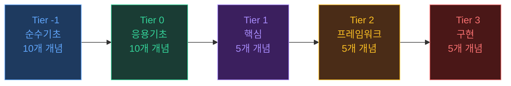
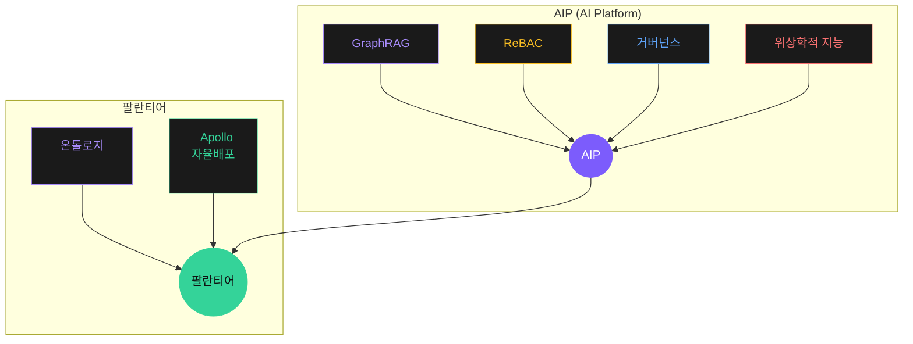

# 개요

**Executive Summary — 5분 안에 파악하기**

> 원본 세미나 자료: [@heretics_gene](https://www.threads.com/@heretics_gene)
> PDF 편집: [@specal1849](https://www.threads.com/@specal1849)
> 교육 사이트 기획: [@comad.j](https://www.threads.com/@comad.j)

---

## 핵심 메시지 5가지

### 1. 확률적 지능에서 구조적 지능으로의 전환

기존 LLM은 "다음 토큰을 확률적으로 예측"하는 기계다. GraphRAG는 여기에 **구조적(Structural)·결정론적(Deterministic) 레이어**를 추가한다. 관계(Relationship)는 벡터 공간에서 유추하는 것이 아니라 **그래프 엣지로 명시적으로 저장**되고, 검색은 그래프 탐색(Graph Traversal)으로 수행된다.

### 2. 온톨로지는 Agent 시대의 유일한 답

> "Agent가 지식을 다루는 가장 본질적인 방법에 해당하는 'Ontology'를 다루지 않으면, 5년 후의 경쟁환경에서, 경쟁하는것이 물리적으로 가능할것인가"

온톨로지 없이 의미 있는 AI 시스템은 불가능하다.

### 3. 메타온톨로지: 팔란티어의 진짜 해자

팔란티어의 경쟁력은 소프트웨어가 아니라, 20년간 수백 개 고객사를 통해 축적한 **메타온톨로지(Meta-Ontology)** — "세상이 어떻게 작동하는지에 대한 구조화된 지식 지도"다.

### 4. 분석공간 6가지: 지능을 해체하는 프레임워크

- **Hierarchy(계층)** · **Temporal(시간)** · **Recursive(재귀)** · **Structural(구조)** · **Causal(인과)** · **Cross-space(다중공간)**
- 이 6가지 분석공간은 지능을 해체하고 측정하는 위상학적 도구다.

### 5. 하나의 기업 = 하나의 거대한 MCP 서버

> "기업이라고 하는것은 그 실체가 완전히 해체되어, [하나의 기업 = 하나의 거대한 MCP 서버]가 되는것이 필연이다"

온톨로지를 기업 시스템에 내재화하지 않은 조직은 중장기 생존이 불가능하다.

---

## 5개 Tier 로드맵

| Tier        | 주제       | 핵심 메시지                                                  |
| ----------- | ---------- | ------------------------------------------------------------ |
| **Tier -1** | 순수 기초  | 확률·벡터·그래프·DB·NLP — AI의 수학적 토대                   |
| **Tier 0**  | 응용 기초  | 임베딩·RAG·지식그래프·에이전트 — 실무 진입점                 |
| **Tier 1**  | 핵심       | GraphRAG·온톨로지·메타엣지·AIP·위상학적 지능 — 패러다임 전환 |
| **Tier 2**  | 프레임워크 | 분석공간·ReBAC·메타온톨로지·벡터풍부화 — 설계 원칙           |
| **Tier 3**  | 구현       | NOMIK·FDE·레버·물리엔진·Active Metadata — 실전 배포          |

---

## 핵심 방정식

## 핵심 비교: 확률적 지능 vs 위상학적 지능

<ComparisonChart
  title="비교 항목"
  leftLabel="확률적 지능 (Pre-GraphRAG)"
  rightLabel="구조적/위상학적 지능"
  :rows="[
    { left: '벡터 유사도', metric: '검색 방식', right: '그래프 탐색 + 벡터', rightHighlight: true },
    { left: '임베딩 공간 유추', metric: '관계 표현', right: '엣지로 명시적 저장', rightHighlight: true },
    { left: '유사도 점수 (0~1)', metric: '측정 기준', right: '그래프 거리·홉 수·위상 불변량', rightHighlight: true },
    { left: '없음 (매번 재생성)', metric: '재사용', right: '온톨로지·관계·메타온톨로지', rightHighlight: true },
    { left: '불가', metric: '도메인 전이', right: '온톨로지 전이(transfer) 가능', rightHighlight: true },
  ]"
/>
