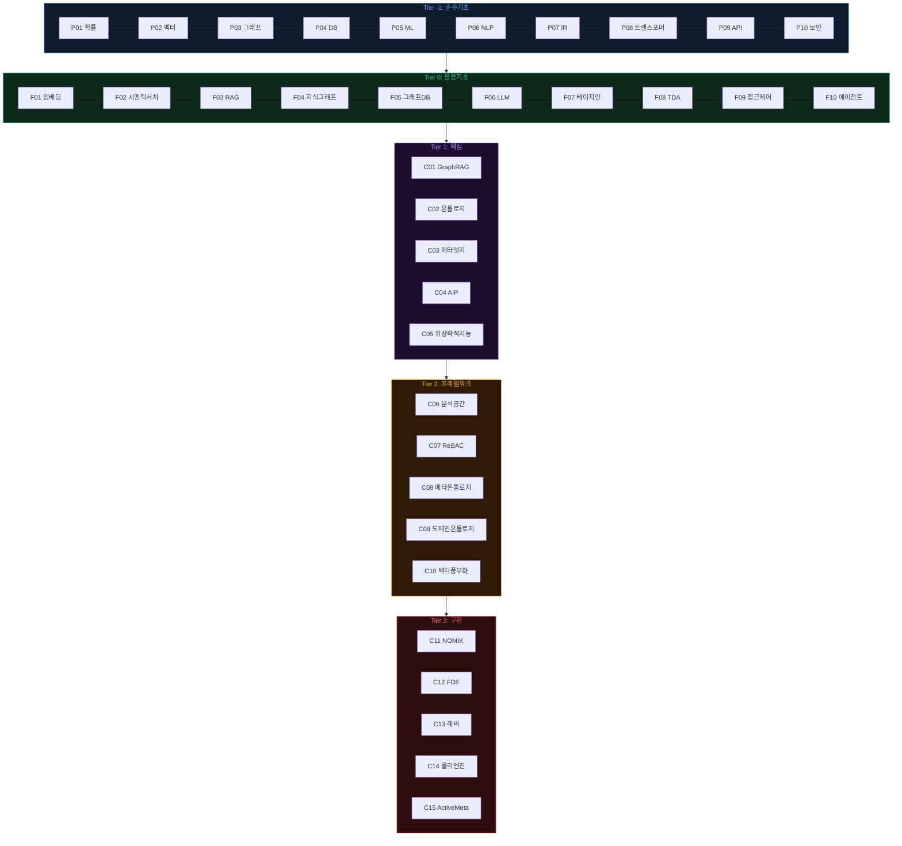

# 학습 로드맵

역할에 맞는 학습 순서를 선택하세요. 각 단계를 클릭하면 해당 문서로 이동합니다.

<LearningPath />

---

## 전체 파이프라인

```mermaid
graph TD
    subgraph T1["Tier -1: 순수기초"]
        P01["P01 확률"] --- P02["P02 벡터"]
        P02 --- P03["P03 그래프"]
        P03 --- P04["P04 DB"]
        P04 --- P05["P05 ML"]
        P05 --- P06["P06 NLP"]
        P06 --- P07["P07 IR"]
        P07 --- P08["P08 트랜스포머"]
        P08 --- P09["P09 API"]
        P09 --- P10["P10 보안"]
    end

    subgraph T0["Tier 0: 응용기초"]
        F01["F01 임베딩"] --- F02["F02 시멘틱서치"]
        F02 --- F03["F03 RAG"]
        F03 --- F04["F04 지식그래프"]
        F04 --- F05["F05 그래프DB"]
        F05 --- F06["F06 LLM"]
        F06 --- F07["F07 베이지안"]
        F07 --- F08["F08 TDA"]
        F08 --- F09["F09 접근제어"]
        F09 --- F10["F10 에이전트"]
    end

    subgraph TC["Tier 1: 핵심"]
        C01["C01 GraphRAG"]
        C02["C02 온톨로지"]
        C03["C03 메타엣지"]
        C04["C04 AIP"]
        C05["C05 위상학적지능"]
    end

    subgraph TF["Tier 2: 프레임워크"]
        C06["C06 분석공간"]
        C07["C07 ReBAC"]
        C08["C08 메타온톨로지"]
        C09["C09 도메인온톨로지"]
        C10["C10 벡터풍부화"]
    end

    subgraph TI["Tier 3: 구현"]
        C11["C11 NOMIK"]
        C12["C12 FDE"]
        C13["C13 레버"]
        C14["C14 물리엔진"]
        C15["C15 ActiveMeta"]
    end

    T1 --> T0
    T0 --> TC
    TC --> TF
    TF --> TI

    style T1 fill:#0d1b2a,stroke:#60a5fa,color:#60a5fa
    style T0 fill:#0d2818,stroke:#34d399,color:#34d399
    style TC fill:#1a0d2e,stroke:#a78bfa,color:#a78bfa
    style TF fill:#2e1a05,stroke:#fbbf24,color:#fbbf24
    style TI fill:#2e0d0d,stroke:#f87171,color:#f87171
```
